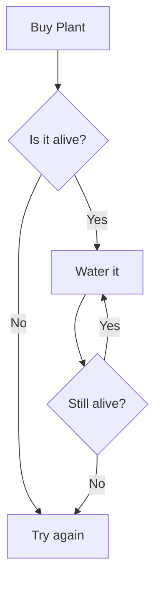
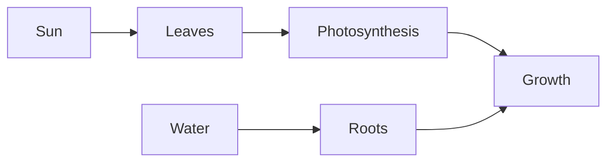

# Plants Inline Editor Test

Clearly this page is not very plant related ...

This page exercises every inline editor feature for manual testing. Click around, move the cursor, and verify the three-state visibility: **rendered** (cursor elsewhere), **ghost** (cursor on the line), **raw** (cursor inside the construct).

## Bold, Italic, and Strikethrough

This sentence has **bold text** in it. This sentence has *italic text* in it. This one has ***bold italic text*** together. And this one has ~~strikethrough text~~ for good measure.

Multiple constructs on one line: **bold** and *italic* and `inline code` and ~~struck~~ all together.

## Headings

The heading above is an H2. Below are more heading levels for size comparison:

### H3 Heading - Slightly Smaller

#### H4 Heading - Getting Smaller

##### H5 Heading - Nearly Normal

###### H6 Heading - Smallest

## Inline Code

Use `console.log()` to debug your [[Plants]]. The `Monstera` class has a `water()` method.

## Links

Here is a [standard link](https://example.com) to a website. And an [AS Notes link](https://www.asnotes.io) for good measure.

### Images

Here is an image reference for hover testing:


## Blockquotes

> "The best time to plant a tree was 20 years ago. The second best time is now."

> Nested blockquote with **bold** and *italic* inside.

## Horizontal Rules

Above and below this text are horizontal rules:

---

They should render as visual separators.

***

## Unordered Lists

- Water the [[Monstera]] weekly
- Check the [[Spider Plant]] for new babies
- Repot the [[Peace Lily]] when roots outgrow the pot
- Fertilise during the growing season
  - Use liquid feed for indoor [[Plants]]
  - Slow release pellets for outdoor ones

## Task Lists (Checkboxes)

- [ ] Buy new soil for spring repotting
- [ ] Check the drainage holes on all pots
- [x] Water the [[Succulent]] (done last week)
- [ ] #P1 Rescue the wilting [[Monstera]] #D-2026-04-01
- [ ] #P2 #W Waiting for plant food delivery
- [x] #P3 Research [[Types of [[Plant]]]] #C-2026-03-20

## Ordered Lists

1. Remove the plant from its current pot
2. Loosen the root ball gently
3. Place in a new, larger pot
4. Fill with fresh compost
5. Water thoroughly

## Code Blocks

```javascript
function waterPlant(plant) {
    if (plant.soilMoisture < 0.3) {
        plant.water(250); // ml
        console.log(`Watered ${plant.name}`);
    }
}
```

```python
def check_sunlight(room):
    """Returns optimal plant placement."""
    if room.window_direction == "south":
        return "Perfect for most plants"
    return "Consider grow lights"
```

## GFM Tables

| Plant | Water Frequency | Light | Difficulty |
|-------|----------------|-------|------------|
| [[Monstera]] | Weekly | Indirect bright | Easy |
| [[Succulent]] | Fortnightly | Direct sun | Very easy |
| [[Peace Lily]] | When droopy | Low to medium | Easy |
| [[Spider Plant]] | Weekly | Indirect | Very easy |

## YAML Frontmatter

This page does not have frontmatter, but the journal entries do. Create a new journal entry to test frontmatter shadowing (`Ctrl+Alt+J`).

## Emoji Shortcodes

Here are some emoji: :smile: :plant: :sun_with_face: :droplet: :seedling: :herb: :evergreen_tree: :fallen_leaf: :warning: :white_check_mark:

## Mermaid Diagrams





## Math / LaTeX

Inline math: the growth rate is $G = k \cdot L \cdot W$ where $L$ is light and $W$ is water.

Display math block:

$$
\frac{dP}{dt} = rP\left(1 - \frac{P}{K}\right)
$$

Where $P$ is population, $r$ is growth rate, and $K$ is carrying capacity.

## GitHub Mentions and Issues

Reported by @plantlover42 in #123. See also @gardenbot's suggestion in #456.

## Wikilinks on Headings

### My Favourite [[Plant]] Species

This heading contains a wikilink. Both the heading decoration and the wikilink decoration should render without conflict.

## Mixed Content Line

A line with **bold**, *italic*, `code`, ~~struck~~, [a link](https://example.com), :seedling:, and a [[Wikilink]] all on one line.

## Outliner Mode Test

When outliner mode is active (`Ctrl+Shift+P` then "AS Notes: Toggle Outliner Mode"), the bullets below should show styled bullets (not raw `-`), and checkboxes should show bullet + checkbox:

- Regular bullet in outliner mode
- Another bullet with **bold** content
- [ ] Unchecked task in outliner mode
- [x] Checked task in outliner mode
  - Nested bullet
  - [ ] Nested unchecked task
