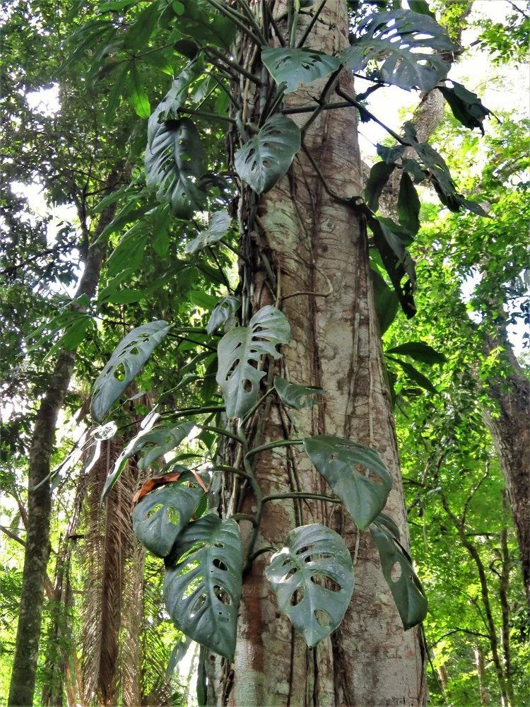

# Plants Outliner Editor Test

This page is a manual stress test for outliner-first editing.

Use it to exercise Enter, Tab, Shift+Tab, todo toggling, fenced code block completion, closing-fence continuation, multi-line paste, inline rendering, image hover, and any formatting or indentation regressions.

## Quick Checks

- Toggle outliner mode and work top to bottom through the bullets below.
  - Press Enter on plain bullets, tasks, nested bullets, and after fenced code blocks.
  - Press Tab and Shift+Tab at different depths, especially near the indentation cap.
  - Toggle todo states with Ctrl+Shift+Enter on plain bullets and existing tasks.
  - Paste multiple lines into a bullet and verify each line becomes a separate bullet.
  - Hover local images, remote links, and wikilinks on indented lines.

## Core Bullet Behaviours

- Root bullet with plain text
  - Child bullet with inline code `soilMoisture < 0.3`
  - Child bullet with a standard [plant reference](https://en.wikipedia.org/wiki/Houseplant)
  - Child bullet with a basic wikilink [[Plant]]
  - Child bullet with nested wikilinks [[Types of [[Plant]]]]
  - Child bullet with punctuation, quotes, and brackets (test) [alpha] {beta}
    - Grandchild bullet at depth 3
      - Great-grandchild bullet at depth 4
  - Final sibling after a deep branch

## Tasks And Metadata

- [ ] Plain unchecked task
- [x] Plain checked task
- [ ] #P1 Critical repotting task #D-2026-04-07
  - [ ] Nested task under a priority item
  - [x] Nested completed task with metadata #C-2026-03-28
- [ ] #P2 #W Waiting for grow light delivery
  - Child note under a waiting task that should stay aligned when indented
- Plain bullet immediately after several tasks

## Image Hover And Asset Paths

- Local asset image on a bullet line 
- Local asset image under an indented content block

  

- Remote image on an indented content block

  

- Asset path written as inline code for copy/edit checks: `../assets/monstera-leaves.png`

## Fenced Code Blocks In Bullets

- JavaScript fence under a bullet. Press Enter after the opening fence and on the closing fence.

  ```javascript
  function waterPlant(plant) {
      if (plant.soilMoisture < 0.3) {
          plant.water(250);
      }
  }
  ```

  - Bullet after a fenced block under the same parent
  - Another sibling bullet after the closing fence

- Python fence with blank lines inside the block

  ```python
  def classify_window(direction):
      if direction == "south":
          return "bright"

      return "medium"
  ```

- Fence without a language label

  ```
  plain text fence
  second line
  ```

- Standalone fence outside bullets for comparison

```sql
select name, watering_schedule
from plants
where watering_schedule = 'weekly';
```

## Inline Code And Mixed Markdown

- A bullet with **bold**, *italic*, `inline code`, ~~strikethrough~~, :seedling:, and [[Wikilink]] on one line
- A bullet that mixes `../assets/monstera-wild.webp`, [external links](https://www.asnotes.io), and [[Philodendron hederaceum]]
- A bullet with escaped punctuation \*not bold\* and backticks like `` `literal` ``

## Headings Nested In A List Item

- Parent bullet for nested heading content

  ### Heading Inside A Bullet

  This paragraph sits inside a list item under a nested heading. Indentation changes around this block should stay stable.

  #### Smaller Nested Heading

  More text under the nested heading with [[Plant]] references and `inline code`.

- Sibling bullet after the nested heading block

## Tables In And Around Outliner Content

- Parent bullet for a nested markdown table

  | Plant | Water | Light | Status |
  | --- | --- | --- | --- |
  | [[Monstera]] | Weekly | Bright indirect | Healthy |
  | [[Peace Lily]] | When droopy | Low to medium | Needs feed |
  | [[Spider Plant]] | Weekly | Indirect | Propagating |

  Continue editing below the table to check cursor recovery and indentation.

- Bullet after the nested table

| Tool | Purpose |
| --- | --- |
| Moisture meter | Check soil dryness |
| Pruners | Remove damaged leaves |

## Blockquotes And Horizontal Rules

- Parent bullet for blockquote content

  > "The best time to plant a tree was 20 years ago. The second best time is now."
  >
  > Second quoted paragraph with **bold** and `code`.

- Bullet after the blockquote

---

- Bullet after a horizontal rule

## Mermaid And Math

- Mermaid block nested under a bullet

  ```mermaid
  flowchart TD
      Seed --> Sprout --> Leaves --> Growth
      Water --> Growth
      Light --> Growth
  ```

- Math block nested under a bullet

  $$
  G = k \cdot L \cdot W
  $$

  Inline math on the next sentence should also render: $P(t) = P_0 e^{rt}$.

## Mixed Multi-Block Sequence

- Start of a longer branch
  - Child bullet before a paragraph block

    This paragraph is intentionally not a bullet. It tests whether editing around wrapped content inside a branch preserves the branch structure.

  - Child bullet before a nested quote

    > Quote nested inside a deeper branch.

  - Child bullet before a nested table

    | Step | Check |
    | --- | --- |
    | 1 | Indent branch |
    | 2 | Add fence |
    | 3 | Resume bullets |

  - Child bullet before a nested image

    

  - Child bullet after paragraph, quote, table, and image blocks

## Final Resume Point

- Final top-level bullet for smoke testing
  - Indent me
  - Outdent me
  - Toggle me into a task
  - Paste several lines here and confirm they become bullets
