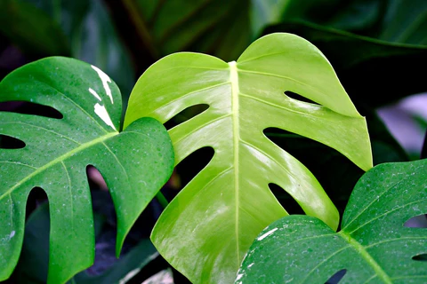

---
aliases:
  - Swiss Cheese Plant
  - Cheese Plant
  - Monstera Deliciosa
---

# Monstera

*Monstera deliciosa* — the Swiss Cheese Plant. Large, theatrical, and deeply aware of how good it looks. The [[Monstera]] has become the icon of the modern houseplant movement and there's a very good reason for that: it's genuinely hard to kill if you give it even a modest amount of attention.

## The Famous Holes

The distinctive holes and splits in [[Monstera]] leaves are called **fenestrations**. They evolved to help the plant survive strong winds and let light through to lower leaves in the wild jungle canopy. In your flat they serve no practical purpose whatsoever but look absolutely incredible.

Young [[Monstera]] plants have solid leaves with no holes. Don't panic. The holes appear as the [[Plant]] matures. Give it light, give it [[[[Plant]] Foods]], and be patient.

## Care Summary

| Factor | Requirement |
|---|---|
| Light | Bright indirect [[Sunlight]] — no harsh direct sun |
| [[Watering]] | Every 1–2 weeks; allow top inch of [[Soil]] to dry |
| [[Soil]] | Well-draining general potting mix |
| Humidity | Appreciates being misted, tolerates normal room humidity |
| Feeding | [[Fertiliser]] every 2–4 weeks in spring/summer |

## Common Problems

- **Yellow leaves**: Usually [[Overwatering]]. Check the [[Soil]]. Stop [[Watering]] until it dries out.
- **Brown, crispy leaf tips**: Too dry or too much direct [[Sunlight]]
- **No new leaves**: Low [[Sunlight]] or needs [[Repotting]]
- **Drooping leaves**: Thirsty. Water it. It'll recover dramatically within an hour, which is very satisfying.

## The Support Pole

In the wild, [[Monstera]] climbs trees using aerial roots. Indoors, a moss pole or coco coir pole lets it climb and produces larger, more fenestrated leaves. This is optional. You don't *have* to give it a climbing pole. But the plant would really appreciate it, and the leaves will be considerably more impressive.

## Propagation

[[Monstera]] can be propagated from stem cuttings placed in water or [[Soil]]. Wait for the aerial roots to develop before potting. This is deeply satisfying and makes excellent gifts for people who are already too invested in their [[Plants]].
