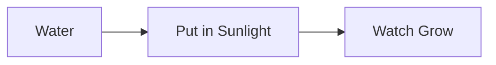

# Caring For Your Plants

## Introduction

Welcome to the definitive guide to keeping [[Plants]] alive — a task that sounds embarrassingly simple until you've killed your third [[Monstera]] in a row and start Googling "why does my plant hate me."

This knowledge base covers everything from the philosophical ("what even IS a plant?") to the deeply practical ("why are all the leaves yellow and should I be worried?"). Spoiler: yes. Yes you should.

This knowledge base serves as a [[Demo]] for [[AS Notes]]. I hope you enjoy this [[Plant Based [[Demo]]]].

### How It Works

### Getting Started

Before rushing out to buy seventeen plants you'll never water, take a moment to educate yourself:

1. So really, [[What are [[Plants]]]]?
2. [[Types of [[Plant]]]]
3. [[[[Plant]] Foods]]
4. [[Sourcing [[[[Plant]] Foods]]]]

### The Basics

Once you've accepted [[Plants]] into your life (and home), you'll need to get to grips with:

- [[Watering]] — more nuanced than "pour water on it"
- [[Sunlight]] — it turns out windows matter
- [[Soil]] — yes, dirt has opinions
- [[Repotting]] — because roots need space too, same as the rest of us

- [ ] Add an item for [[Plant Food]]

### Plant Profiles

Not all [[Plants]] are created equal. Some are divas. Some are basically indestructible. Learn about specific species before committing:

- [[Monstera]] — dramatic, gorgeous, will reward you handsomely
- [[Succulent]] — basically a plant for people who travel a lot and feel guilty about it
- [[Peace Lily]] — thrives on neglect, which is frankly relatable
- [[Spider Plant]] — produces babies at an alarming rate

### When Things Go Wrong

And they will go wrong. Don't panic. Probably. See:

- [[Overwatering]] — the number one plant killer. It comes from love. It still kills plants.
- [[Pests]] — tiny uninvited guests that are extremely hard to evict
- [[Yellow Leaves]] — a plant's passive-aggressive way of expressing dissatisfaction
- [[Root Rot]] — bad news. Like, very bad news.

### Seasonal Care

[[Plants]] have opinions about the time of year. Consult the [[Season Guide]] before making any bold decisions like repotting in December.

### Tools of the Trade

You'll want the right equipment. Or at least a [[Watering Can]] and some [[Fertiliser]]. Don't overcomplicate it.